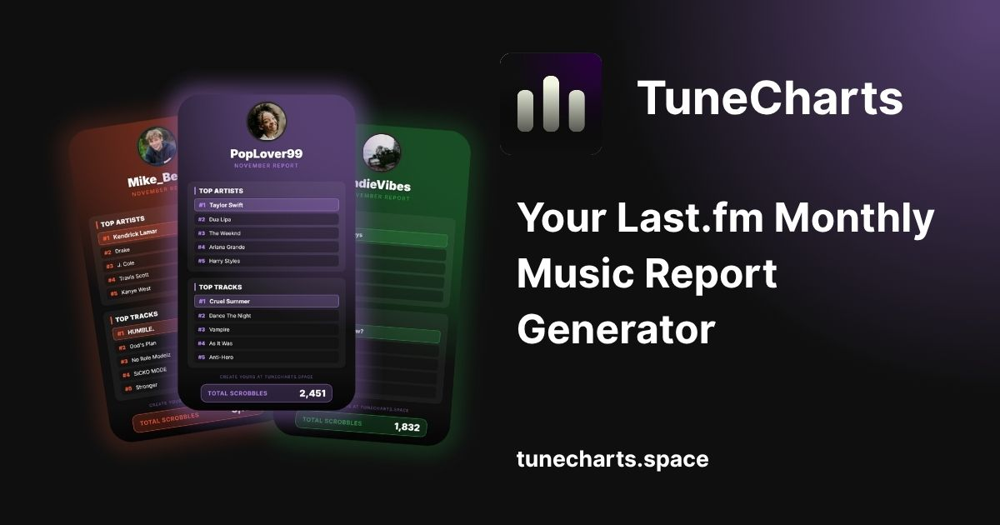

# TuneCharts 📊



> **Your Last.fm Monthly Music Report Generator.** > Create aesthetic, shareable charts for Instagram Stories and Feeds based on your listening history.

[](LICENSE)
[]()
[](https://www.last.fm/)

## 📖 About

TuneCharts is a web tool that visualizes music listening data from Last.fm. It solves the problem of boring spreadsheets by converting user statistics into beautiful, modern cards ready for social media sharing.

It operates on a **privacy-first** basis: no user data is stored permanently. We fetch, visualize, and discard.

## ✨ Features

* **Multiple Periods:** Filter by **Last 7 Days**, **Last Month**, or **Last Year**.
* **Dual Formats:**
    * 📱 **Story (9:16):** Perfect for TikTok, Instagram Stories, and WhatsApp.
    * 🔲 **Square (1:1):** Ideal for Feeds, Twitter (X), and Facebook.
* **Custom Branding:** Users can pick from 8 accent colors to match their vibe.
* **Smart Logic:** Automatically handles cached data and ensures accurate chart generation.
* **Privacy Focused:** Runs on client-side logic with transient processing.

## 🛠️ Tech Stack

* **Core:** HTML5, CSS3, Vanilla JavaScript.
* **Styling:** Custom CSS variables, Flexbox/Grid layout, Backdrop filters.
* **API:** Last.fm API (via secure backend proxy).
* **Libraries:** `html2canvas` (for generating the downloadable images).
* **Analytics:** Google Analytics 4 (GA4).

## 🚀 How to Run Locally

To run this project, you will need a Last.fm API Key.

1.  **Clone the repository**
    ```bash
    git clone [https://github.com/seu-usuario/tunecharts.git](https://github.com/seu-usuario/tunecharts.git)
    ```

2.  **Setup the Backend Proxy**
    * *Note:* This project relies on a backend proxy (located in `/api/`) to hide the API Key.
    * You need to create a server-side script (PHP/Node) that accepts the requests from `resultado.js` and appends your `API_KEY`.

3.  **Open the project**
    * Host the files on a local server (e.g., Live Server for VS Code) or deploy to a static host that supports backend functions (like Vercel or Netlify).

## ⚠️ Important Notes & Credits

* **Scrobble Count:** The scrobble count might differ slightly from the official website due to caching times.
* **API Limits:** This tool respects Last.fm's rate limits.
* **Disclaimer:** This is a fan-made tool and is not affiliated with Last.fm Ltd.

## 📄 License

This project is licensed under the **GNU General Public License v3.0** - see the [LICENSE](LICENSE) file for details.

---
<p align="center">
  Created with ❤️ by <a href="https://github.com/seu-usuario">DreyWe</a>
</p>
